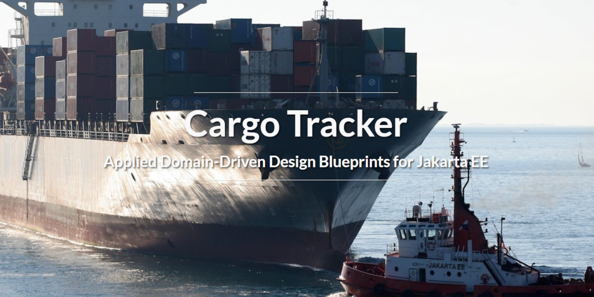

# Rastreador de Carga

###### Este projeto é baseado no original [Eclipse Cargo Tracker - Applied Domain-Driven Design Blueprints for Jakarta EE](https://github.com/eclipse-ee4j/cargotracker)

O projeto demonstra como você pode desenvolver aplicações com *Jakarta EE* utilizando as melhores práticas arquiteturais amplamente adotadas, como Domain-Driven Design (DDD). 

A aplicação é um sistema de fim-a-fim para manter o controle da cargas marítimas. 
Ele possui várias interfaces descritas nas seções seguintes.
Para mais detalhes sobre o projeto, por favor, visite: https://eclipse-ee4j.github.io/cargotracker/.

 
 ## Começando

O [site do projeto](https://eclipse-ee4j.github.io/cargotracker/) tem informações detalhadas sobre como começar.

Os passos mais simples são os seguintes (sem necessidade de IDE):

* Obter o código fonte do projeto.
* Certifique-se de estar executando Java SE 8, Java SE 11 ou Java SE 17.
* Certifique-se de que o JAVA_HOME está configurado.
* Desde que você tenha a Maven configurada corretamente, navegue até a raiz do código-fonte do projeto e 
  tipo: `mvn clean package cargo:run`
* Vá para http://localhost:8080/cargo-tracker

Para executar o projeto no Eclipse, siga estes passos:

* Configurar Java SE 8, Java SE 11 ou Java SE 17, [Eclipse for Enterprise Java Developers](https://www.eclipse.org/downloads/packages/) e [Payara 5](https://www.payara.fish/downloads/). Você também precisará configurar [Payara Tools](https://marketplace.eclipse.org/content/payara-tools) no Eclipse.
* Importar este código no Eclipse como um projeto Maven, 
  Eclipse fará o resto por você. Proceda com o clean/building da aplicação.
* Depois que o projeto for construído (o que levará algum tempo, pois a Maven baixa pela primeira vez todas as dependências), simplesmente execute-o através do Payara 5.

## Explorando a aplicação

Após a execução do aplicativo, ele estará disponível em: 
http://localhost:8080/cargo-tracker/. Por baixo dos panos, a aplicação utiliza um 
número de funcionalidades do Jakarta EE, incluindo: Faces, CDI, Enterprise Beans, Persistence, REST, Batch, JSON Binding, Bean Validation and Messaging.

Há várias interfaces web, REST e até uma interface para escanear o sistema de arquivos. 
Provavelmente, é melhor começar a explorar as interfaces seguindo a ordem abaixo.

A **interface de rastreamento** permite que você acompanhe o status da **carga** (cargo) e é
destinado ao público em geral. Tente inserir uma identificação de **rastreamento** (tracking) como ABC123 (a 
aplicação é pré-carregada com alguns dados de amostra (ou sample data) ).

A **interface administrativa** é destinada à **empresa de navegação**(shipping company) que administra
carga. A landing page, desta interface, é um _dashboard_ que fornece uma 
visão da carga registrada. Você pode reservar a carga usando a **interface de reserva**.
Uma vez que a carga é **reservada** (booked), você pode **encaminhar** (route) a carga. Quando você inicia um **pedido de roteamento** (routing request),
o sistema determinará as **rotas** (routes) que podem funcionar para a carga. Uma vez que você selecione
uma rota, a carga estará pronta para processar **eventos de manuseio** (handling events) no porto. Você pode
também mudar o destino da carga, se necessário, ou **rastrear a carga** (track cargo).

A **interface de Registro de Eventos de Manuseio** (Handling Event Logging interface) é destinada ao pessoal portuário que registra o que 
aconteceu com a carga. A interface é destinada, principalmente, para dispositivos móveis, mas
você pode usá-lo através de um navegador no computador. A interface está acessível nesta URL: http://localhost:8080/cargo-tracker/event-logger/index.xhtml. 
Caso queira, você pode usar um emulador de celular em vez de um dispositivo móvel real. 
Em geral, a carga passa por esses **eventos**:

* É **recebido** no local de origem.
* É **carregado** (loaded) e **descarregado** (unloaded) em **viagens** (Voyages) em seu itinerário.
* É **reinvidicado** (claimed) no local de destino.
* Pode passar pela **alfândega** (customs) em pontos arbitrários.

Ao preencher o formulário de registro do evento, é melhor ter o itinerário à mão. 
Você pode acessar o itinerário para carga registrada através da interface administrativa. 
O manuseio da carga é feito através de Messaging para assegurar escalabilidade. 
Ao utilizar o **registrador de eventos** (event logger), observe que somente os eventos de carga e descarga requerem a viagem (voyage) associada.

Você também deve explorar a interface de registro de **eventos em massa baseada** (based bulk event) no sistema de arquivos. 
Ela lê os arquivos sob `/tmp/uploads`. Os arquivos são apenas arquivos CSV. 
Um modelo do CSV está disponível em [src/test/sample/handling_events.csv](src/test/sample/handling_events.csv). 
O modelo está configurado para corresponder aos demais eventos do itinerário da carga ABC123. 
Certifique-se de atualizar os horários na primeira coluna do arquivo CSV do modelo para coincidir também com o itinerário.

As entradas processadas com sucesso são arquivadas em `/tmp/archive`. Quaisquer registros com falhas são arquivados sob `/tmp/falha`.

Não se preocupe em cometer erros. A aplicação pretende ser tolerante a erros. 
Se você se deparar com problemas, você deve [reporta-los](https://github.com/eclipse-ee4j/cargotracker/issues).

Você pode simplesmente remover `./cargo-tracker-data` do sistema de arquivos para reiniciar novamente. 
Este diretório normalmente estará abaixo de $your-payara-installation/glassfish/domains/domain1/config.

Você também pode usar os scripts da `soapUI` para explorar o interfaces REST, bem como os numerosos testes unitários que cobrem a base de código 
em geral. Alguns dos testes utilizam [Arquillian](http://arquillian.org/).

## Explorando o Código

Como mencionado anteriormente, o verdadeiro objetivo da aplicação é demonstrar como 
criar aplicações de Jakarta EE bem arquitetadas e eficazes. Para tal fim, uma vez que você 
conhecer um pouco das funcionalidades da aplicação o que segue 
é mergulhar diretamente no código.

O DDD é um aspecto chave da arquitetura, por isso é importante obter pelo menos um 
entendimento de funcionamento do DDD. Como o nome implica, o Design Dirigido por Domínio é um 
abordagem para o projeto (design) e desenvolvimento de software que se concentra no domínio central e 
lógica de domínio.

Na maior parte das vezes, tudo bem se você é novo em Jakarta EE. Desde que você tenha um compreensão básica das aplicações do lado do servidor, o código deve ser o suficiente para começar. Para aprender mais sobre Jakarta EE, recomendamos alguns links na seção de recursos do site do projeto. 
É óbvio que o usuário ideal deste projeto é alguém que tenha um conhecimento básico de Java, Jakarta EE e DDD. Embora não seja nosso objetivo ser um tutorial completo para demonstrar a grande quantidade de APIs e recursos em Jakarta EE, utilizamos um conjunto bem representativo. 
Você descobrirá que vai aprender uma quantidade razoável de coisas, simplesmente investigando o código para ver como essas coisas são implementadas.

## Demonstração na nuvem
O Cargo Tracker é implantado em Kubernetes na nuvem usando o workflow do GitHub Actions. Você pode encontrar a implantação de demonstração na nuvem de Scaleforce (https://cargo-tracker.j.scaleforce.net). Somos muito grato aos nossos patrocinadores [Jelastic](https://jelastic.com) e [Scaleforce](https://www.scaleforce.net) por hospedar a aplicação demo! O _deployment_ e todos os dados são atualizados durante a noite. Na nuvem Cargo Tracker usa PostgreSQL como base de dados. O [GitHub Container Registry](https://ghcr.io/eclipse-ee4j/cargo-tracker) é usado para publicar imagens do Docker.

## Contribuindo
Este projeto está em conformidade com o [Google Java Style Guide] (https://google.github.io/styleguide/javaguide.html). Você pode usar a ferramenta [google-java-format](https://github.com/google/google-java-format) para ajudá-lo a cumprir com o Guia do Google para Java. Você pode usar a ferramenta com a maioria das principais IDEs, como Eclipse e IntelliJ.

Além disso, para todos os arquivos XML, XHTML e HTML, usamos uma largura de coluna/linha de 100 e usamos 4 espaços para indentação. Por favor, ajuste as configurações de formatação de sua IDE de acordo.

Para maiores orientações sobre como contribuir, incluindo o roteiro do projeto, por favor, veja [aqui](CONTRIBUTING.md).

## Questões (Problemas) Conhecidas
* Ao carregar o projeto na IDE Eclipse, você pode receber algumas mensagens falsas de falha de validação nos descritores de implementação XML (estes são essencialmente erros no Eclipse). Você pode simplesmente ignorar estas falsas mensagens de validação ou excluí-las, indo para a aba Markers.
* Você pode receber uma mensagem de registro declarando que os certificados SSL da Payara expiraram. Isto não vai atrapalhar a funcionalidade, mas
  parar de imprimir mensagens de registro para o console IDE. Você pode resolver este problema removendo manualmente os certificados expirados do domínio Payara, uma vez que explicado [aqui](https://github.com/payara/Payara/issues/3038).
* Se você reiniciar a aplicação algumas vezes, você se deparará com um bug causando uma falha espúria na implantação. Embora o problema possa ser incômodo, ele é inofensivo. Basta executar novamente a aplicação.
* Às vezes quando o servidor não é desligado corretamente ou há um problema de bloqueio/permissões, o banco de dados H2 da aplicação são corrompidos, resultando em estranhos erros de banco de dados. Se isso ocorrer, você precisará parar a aplicação e limpar o banco de dados. Você pode fazer isso simplesmente removendo o diretório de dados do rastreador de carga do arquivo e reiniciar a aplicação. Este diretório normalmente estará abaixo de $$your-payara-installation/glassfish/domains/domain1/config.
